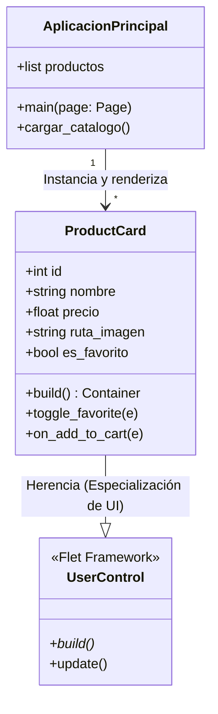

# 🚀 Catálogo de Productos Reutilizable - Proyecto Integrador


Este repositorio contiene la capa de presentación y lógica visual para un catálogo interactivo de artículos tecnológicos (Huawei Tech Store). El objetivo principal de esta competencia es el diseño de componentes visuales reutilizables aplicando principios de encapsulamiento, diseño modular y gestión de recursos locales mediante el framework Flet.

El proyecto demuestra la separación entre el modelo de datos estático (diccionarios) y la interfaz gráfica, preparando la arquitectura para un futuro consumo de APIs.

## 📖 Descripción del Proyecto
Este Proyecto Integrador representa una solución integral de Frontend Engineering orientada a la creación de interfaces dinámicas y escalables. El núcleo del desarrollo se basa en la construcción de un Catálogo de Productos Reutilizable, donde se ha priorizado la separación de responsabilidades y la eficiencia del renderizado utilizando el framework Flet (basado en Flutter).

#### Pilares de la Implementación:
* Arquitectura Basada en Componentes (Component-Based Architecture): Se ha abandonado el desarrollo lineal para adoptar un modelo de componentes atómicos. La clase ProductCard funciona como una unidad independiente, encapsulando estilos, lógica de eventos y manejo de estado. Esto permite que la interfaz sea altamente mantenible y que los componentes puedan ser reutilizados en diferentes vistas del ecosistema de la aplicación.

* Paradigma POO y Abstracción: Utilizando Programación Orientada a Objetos, se implementó la herencia de controles (ft.UserControl). Esta abstracción permite que cada tarjeta de producto gestione su propio ciclo de vida y responda a interacciones del usuario (como el cambio de estado de favoritos o la agregación al carrito) sin necesidad de refrescar la página completa, optimizando el rendimiento de la aplicación.

* Diseño Responsivo y Adaptativo: Se implementó una lógica de layout utilizando ResponsiveRow y Column, asegurando que el catálogo mantenga una experiencia de usuario (UX) consistente en diversas resoluciones de pantalla, desde dispositivos móviles hasta aplicaciones de escritorio de alta resolución.

* Gestión de Recursos Estáticos (Assets): Se estableció un pipeline de gestión de archivos locales para el renderizado de imágenes, configurando rutas relativas que facilitan la portabilidad del código y aseguran la correcta visualización de la identidad visual de los productos (Huawei Store) en entornos tanto locales como en la nube.

* Preparación para Integración con APIs: La arquitectura actual ha sido diseñada bajo el principio de "listo para producción". Al desacoplar la representación visual de la lista de datos (PRODUCTS), el sistema está preparado para una transición transparente hacia una integración con servicios REST API o bases de datos NoSQL en fases futuras de desarrollo.
  
## 🛠️ Stack Tecnológico
Lenguaje: Python 3.10+

Framework: Flet (Basado en Flutter)

Despliegue: Netlify

Control de Versiones: Git / GitHub
## 1. Diagrama de Clases
A continuación, se presenta la estructura orientada a objetos del proyecto, destacando la herencia del componente personalizado ProductoCard y su interacción con el flujo de la aplicación.
La base de este proyecto es la **herencia de controles**. Hemos extendido las capacidades nativas de Flet para crear componentes especializados, permitiendo que la interfaz sea altamente mantenible.


### Detalles del Diseño:
* **Encapsulamiento:** La clase ProductCard encapsula tanto su estructura visual (Layout) como su comportamiento (eventos de clic y manejo de estado interno).

* **Reutilización:** Al heredar de UserControl, el componente se vuelve un "widget" independiente que puede ser insertado en cualquier parte de la aplicación sin duplicar código.
## Arquitectura y Uso de Herencia: El Poder de UserControl
La piedra angular de este proyecto es la implementación de la clase ProductCard mediante la herencia de ft.UserControl. En el desarrollo de software moderno, esta decisión técnica es superior a simplemente crear funciones que retornen componentes, debido a las siguientes razones:

* Encapsulamiento de Diseño y Lógica: Al heredar de UserControl, hemos creado un "Widget Propietario". El componente encapsula toda la complejidad estética —como el BorderRadius, la elevación de las sombras (BoxShadow), y el layout interno (Column, Container)— dentro de un único objeto. Esto evita la contaminación del código principal con detalles de implementación visual.

* Modularidad y Reutilización: Cada instancia de ProductCard es independiente. Esto permite que el componente sea inyectado en un GridView, un ListView o un ResponsiveRow de manera transparente. Si se requiere un cambio en el diseño de la tarjeta, solo se modifica la clase ProductCard, y el cambio se propaga automáticamente en toda la aplicación.

* Abstracción de Datos (Preparación para APIs): Esta arquitectura desacopla la Vista del Modelo. Actualmente, la clase recibe un diccionario o un objeto de datos local; sin embargo, al estar encapsulada, el proyecto está listo para la Unidad 4. En esa fase, podremos integrar una API REST mediante el uso de métodos asíncronos dentro de la misma clase, permitiendo que la UI se actualice de forma reactiva sin necesidad de reescribir ni una sola línea de la estructura visual.

---
```python
# Ejemplo de herencia para encapsulamiento
class ProductCard(ft.UserControl):
    def __init__(self, product):
        super().__init__()
        self.product = product

    def build(self):
        # El diseño vive aquí, aislado del resto de la app
        return ft.Container(content=ft.Text(self.product["name"]))
```
## Gestión de Recursos Locales (Assets)
Para garantizar la portabilidad y la correcta renderización de la identidad visual de la tienda (Huawei Store), se implementó una gestión técnica de archivos estáticos basada en rutas relativas.

### 1. Configuración del Directorio de Recursos
El framework Flet requiere una declaración explícita de dónde residen los archivos multimedia. Esto se logra mediante el parámetro assets_dir en el punto de entrada de la aplicación. Esta configuración permite que el servidor interno de Flet mapee la carpeta local y la sirva como la raíz de recursos para el navegador o la aplicación de escritorio.

---
```python
if __name__ == "__main__":
    # Inicialización de la app definiendo el directorio de recursos estáticos
    ft.app(target=main, assets_dir="assets")
```
### 2. Estructura de Carpetas Sugerida
Para que el framework reconozca los recursos de manera eficiente, se debe seguir una jerarquía de directorios donde la carpeta de activos esté al mismo nivel que el script de ejecución:
```python
📁 MiProyecto/
├── 📄 main.py          <-- Punto de entrada
└── 📁 assets/          <-- Carpeta declarada en assets_dir
    ├── 📁 images/
    │   └── 🖼️ matebook.png
    └── 🖼️ favicon.png
```

<br>Cuando se instancia un control de imagen dentro del componente (ej. ft.Image(src=producto["ruta_imagen"])), Flet busca automáticamente el valor de la cadena (por ejemplo, "laptop.png") dentro de la carpeta assets definida. Esta configuración no solo optimiza la carga local, sino que emula el comportamiento de un servidor web sirviendo archivos estáticos a la ruta raíz del cliente frontend.
### 3. Implementación de Rutas Relativas
Una vez configurado el assets_dir, el acceso a las imágenes dentro del código no debe incluir la palabra "assets" en la ruta, ya que el framework ya se encuentra posicionado en dicho directorio. Se utiliza una diagonal inicial (/) para indicar que la ruta parte de la raíz de activos definida:

* **Correcto: ft.Image(src="/images/matebook.png")**

* **Incorrecto: ft.Image(src="C:/Users/Proyecto/assets/images/matebook.png")**

Esta técnica es vital para el Deployment, ya que permite que la aplicación funcione en cualquier servidor (como Netlify) sin modificar rutas de disco duro local.
### 4. Despliegue de la Interfaz y Responsividad
Para la organización visual del catálogo en la ventana principal, se descartó el uso de coordenadas absolutas o tablas estáticas en favor de un diseño fluido. Esto se logró implementando el contenedor ft.Row con la propiedad de envoltura activada (wrap=True).

Esta implementación ofrece dos grandes ventajas técnicas:

* **Renderizado Dinámico:** Mediante la técnica de comprensión de listas en Python ([ProductoCard(p) for p in productos]), la vista principal lee la capa de datos (el arreglo de diccionarios) e instancia automáticamente las tarjetas necesarias. Si el arreglo crece a 100 productos en el futuro, la interfaz se adaptará sin escribir una sola línea de código adicional.

* **Comportamiento Responsivo:** La propiedad wrap=True actúa de manera equivalente a un Flexbox en el desarrollo web. Al detectar que la sumatoria del ancho de las tarjetas (width=250 + spacing=20) supera el viewport (ancho disponible de la ventana), el contenedor empuja automáticamente los elementos excedentes hacia una nueva línea inferior. Esto garantiza una experiencia de usuario (UX) consistente en cualquier resolución de pantalla.
### 5. Galería de Evidencias
A continuación, se presentan las capturas de ejecución que demuestran la correcta repetición de los componentes según el modelo de datos y el comportamiento dinámico del layout.

* **Nota:** Las siguientes imágenes evidencian cómo una única clase base (ProductoCard) es capaz de renderizar información distinta (fotografías, descripciones y precios) iterando sobre los 5 artículos tecnológicos de la tienda.

#### Vista de Cuadrícula (Pantalla Maximizada)
Se observa el renderizado del catálogo completo y la carga exitosa de las imágenes locales desde el directorio de recursos configurado.

#### Vista Responsiva (Ventana Reducida)
Se demuestra el funcionamiento del enrutamiento de filas, ajustando dinámicamente las tarjetas a nuevas líneas al reducir el ancho de la ventana.


https://github.com/user-attachments/assets/cc8d80f1-0006-4e70-8e28-085461436439
## Código Fuente y Despliegue Web
La arquitectura de Flet permite que este mismo código base, desarrollado inicialmente como una aplicación de escritorio, pueda ser compilado y desplegado como una Aplicación Web (SPA - Single Page Application) sin necesidad de reescribir la lógica en lenguajes como HTML, CSS o JavaScript.

📄 Código Principal:

---
```python
import flet as ft

# -----------------------------
# 1. MODELO DE DATOS (Huawei)
# -----------------------------
productos = [
    {"id": 1, "nombre": "Huawei MateBook D14", "descripcion": "Procesador Intel Core i5, 16GB RAM, 512GB SSD. Pantalla FullView.", "precio": 12999, "ruta_imagen": "laptop.png"},
    {"id": 2, "nombre": "Huawei Nova 14 Pro", "descripcion": "Cámara XMAGE de ultra iluminación, Pantalla Kunlun Glass.", "precio": 14998, "ruta_imagen": "phone.png"},
    {"id": 3, "nombre": "Huawei FreeBuds Pro 3", "descripcion": "Cancelación de ruido activa 3.0, Sonido de alta resolución.", "precio": 2997, "ruta_imagen": "headphones.png"},
    {"id": 4, "nombre": "Huawei Watch GT 4", "descripcion": "Monitoreo de salud profesional y batería de larga duración.", "precio": 2998, "ruta_imagen": "watch.png"},
    {"id": 5, "nombre": "Huawei MatePad 11", "descripcion": "Pantalla de 120Hz, ideal para productividad y diseño.", "precio": 2340, "ruta_imagen": "keyboard.png"},
]

# -----------------------------
# 2. COMPONENTE REUTILIZABLE (Estilo "Perfuma" corregido)
class ProductoCard(ft.Container):

    def __init__(self, producto):

        super().__init__()

        self.width = 250
        self.height = 360
        self.padding = 10
        self.border_radius = 15
        self.bgcolor = ft.Colors.WHITE

        self.content = ft.Column(
            expand=True,
            spacing=8,
            controls=[

                # Imagen
                ft.Stack(
                    
                    width=230,
                    height=150,
                    controls=[

        # Imagen
                        ft.Image(
                            src=producto["ruta_imagen"],
                            width=230,
                            height=150,
                            fit="cover"
                            ),

        # Botón corazón
                        ft.Container(
                            content=ft.IconButton(
                                icon=ft.Icons.FAVORITE_BORDER,
                                icon_color=ft.Colors.RED_400,
                            ),
                            left=5,
                            top=5
                            )
                     ]
                ),
                # Nombre
                ft.Text(
                    producto["nombre"],
                    size=18,
                    weight="bold",
                    color=ft.Colors.BLACK_38,

                ),

                # Descripción
                ft.Text(
                    producto["descripcion"],
                    size=12,
                    color=ft.Colors.BLACK_54
                ),

                # Barra de acciones
                ft.Container(expand=True),

        # Barra inferior
                ft.Row(
                    alignment=ft.MainAxisAlignment.SPACE_BETWEEN,
                    controls=[
                # Precio
                ft.Text(
                    f"${producto['precio']}",
                    size=16,
                    weight="bold",
                    color=ft.Colors.RED_100
                ),
                ft.ElevatedButton(
                    "Agregar",
                    icon=ft.Icons.SHOPPING_CART
                        )
                    ]
                )
            ]
        )


# -----------------------------
# 3. INTERFAZ PRINCIPAL
# -----------------------------
def main(page: ft.Page):
    page.title = "Huawei Tech Store"
    page.bgcolor = "#F5F5F7"
    page.scroll = "auto"

    header = ft.Text(
        "Huawei Store",
        size=30,
        weight="bold",
        color="black87",
    )

    # Generar las tarjetas
    catalogo = ft.Row(
        controls=[ProductoCard(p) for p in productos],
        wrap=True,
        spacing=20
    )

    page.add(
        header,
        ft.Divider(height=10, color="transparent"),
        catalogo
    )

if __name__ == "__main__":
    # Asegúrate de que tus fotos estén en la carpeta 'assets'
    ft.app(target=main, assets_dir="assets")
```

🌐 Despliegue en Vivo: La interfaz visual ya compilada y alojada en la nube puede visualizarse en el siguiente enlace:

https://clever-gnome-5bb4dc.netlify.app/
## Conclusión del Proyecto Integrador
El desarrollo de este catálogo interactivo cumple exitosamente con el Objetivo de la Competencia de la Unidad 2, demostrando que la construcción de interfaces gráficas modernas debe ir más allá de la simple colocación de controles en una pantalla.

Al encapsular el diseño y la lógica en una Custom Card mediante Programación Orientada a Objetos, se logró crear un componente visualmente atractivo y, sobre todo, altamente reutilizable. Esta metodología de trabajo no solo optimiza las líneas de código y facilita la detección de errores, sino que consolida bases fundamentales para la formación en Ingeniería en Sistemas Computacionales dentro del Instituto Tecnológico de Cuautla.

El proyecto deja una arquitectura limpia y modularizada, donde la separación entre la interfaz (Frontend) y los datos locales (diccionarios) garantiza que la aplicación está lista para escalar en la Unidad 4, permitiendo una transición fluida hacia el consumo de bases de datos o APIs REST sin afectar la experiencia del usuario final.
